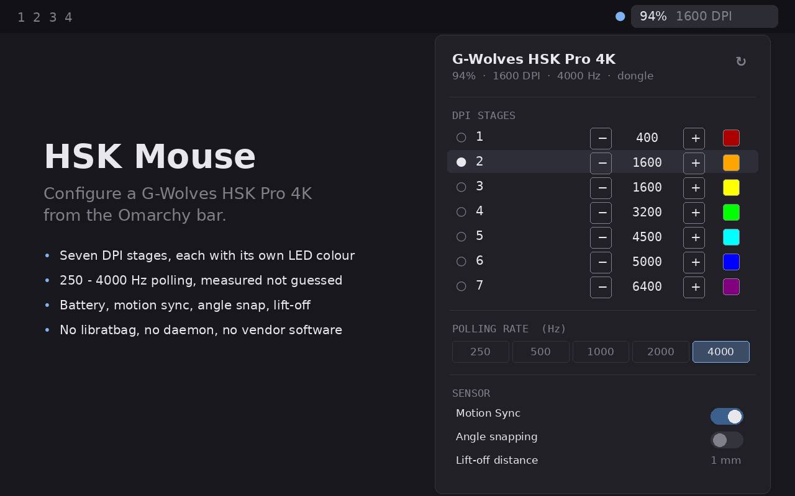

# HSK Mouse — an Omarchy plugin

Battery, DPI, polling rate and sensor settings for the **G-Wolves HSK Pro 4K**,
in the Omarchy bar.



The HSK Pro 4K has no libratbag support, and G-Wolves' web configurator does not
support this model — it ships a Windows-only app. So there was no way to change
DPI or polling rate from Linux at all. This plugin talks to the mouse directly
over raw HID, using a protocol recovered from that Windows app.

## Install

Two steps. **Both are required** — the second is not optional polish.

```bash
omarchy plugin add https://github.com/keasbeexd/omarchy-hsk.git
omarchy plugin enable io.github.keasbeexd.hsk
```

```bash
~/.config/omarchy/plugins/io.github.keasbeexd.hsk/install.sh --udev
```

Then **unplug and replug** the mouse or its dongle, and add the **HSK Mouse**
widget to your bar.

Why the second step matters: configuring the mouse means sending HID *feature*
reports, and the hidraw ioctls that carry those need the device node opened
read-write. `/dev/hidraw*` is root-only by default, so without the rule the
plugin cannot reach the mouse at all — not even to read the battery. The rule
grants access to whoever is logged in at the seat (the same `uaccess` mechanism
your sound card uses), scoped to G-Wolves' vendor id and nothing else. The
script shows you exactly what it will write before asking for `sudo`.

If something looks wrong, `hskctl doctor` says in the first few lines whether
permissions are the problem.

Requires Python 3.9+. Nothing else — no pip packages, no daemon, no background
service, no libratbag. The CLI the widget drives ships inside the plugin.

## What it does

| | |
|---|---|
| **Battery** | percentage in the bar, low-battery warning, charging state |
| **DPI** | seven stages, each with its own value and LED colour |
| **Polling rate** | 250, 500, 1000, 2000 and 4000 Hz |
| **Sensor** | motion sync, angle snapping, lift-off distance |
| **Firmware** | version and link (dongle or cable) |

Everything above is confirmed working on real hardware. Nothing is a guess
carried over from another vendor's mouse.

## Using it

**Bar widget:** left click opens the panel, right click cycles DPI stage,
middle click refreshes.

**In the panel**, each DPI stage is a row: a selector for the active stage,
`−`/`+` buttons that step by 50 DPI (hold to repeat), and a swatch that cycles
the stage's LED colour.

Rapid input is coalesced — hold `+` from 400 to 3200 and the mouse gets one
write, when you stop — and the panel says *Writing to the mouse…* whenever an
exchange is in flight, because a write is a real USB round trip and silence
reads as a dead click.

**Keyboard:** `↑`/`↓` between rows, `←`/`→` to adjust the row under the cursor,
`Enter` to select a stage, `c` to cycle its colour, `1`–`7` to switch straight
to a stage, `d` to cycle DPI, `m` for motion sync, `r` to refresh.

The panel only renders controls for settings that can actually be written, so it
never offers an action that comes back as an error.

## From the command line, and from scripts

The plugin is a front end for `hskctl`, which is useful on its own:

```bash
hskctl status                    # everything the mouse reports
hskctl set pollingRate 4000
hskctl set dpiStage1 1600
hskctl doctor                    # raw bytes of every read; writes nothing
```

`--json` on any command gives parseable output, including on failure.

Omarchy IPC works too:

```bash
omarchy-shell io.github.keasbeexd.hsk cycleDpi
omarchy-shell io.github.keasbeexd.hsk setPollingRate 1000
```

## Settings

| Setting | Default | |
|---|---|---|
| Refresh interval | 60s | how often the bar re-reads the mouse |
| Low battery warning | 15% | when the icon turns urgent |
| Show battery percentage | on | number beside the icon in the bar |
| Path to `hskctl` | *(bundled)* | override only if you installed it yourself |

## Other HSK models

The protocol lives in `profiles/*.json` as data, interpreted by a generic
engine — there is no device-specific code. The vendor app matches 14 product
IDs across the HSK range, so the other variants very likely speak the same
protocol. If you have one, `hskctl probe` and `hskctl doctor` will tell you, and
adding it is a new profile rather than a code change. Issues welcome.

## How the protocol was recovered

Statically, from `G-Wolves_Software_V1.0.20.07` — a C++/CLI mixed-mode .NET
binary. The `hts_*` functions compile to managed CIL, so `hts_send_cmd` and the
`HTS_*_CMD` byte arrays were read directly out of the shipped binary rather than
inferred from USB captures.

```
hts_send_cmd(tx, rx):
    Sleep(60); hid_send_feature_report(h, tx, 65)
    Sleep(60); hid_get_feature_report(h, rx, 65)
    accept iff rx[1] == 0xA1
```

65-byte HID Feature reports, report id 0, no checksum. Byte 2 is the payload
length, byte 3 the opcode (**read opcode = write opcode + 0x80**), byte 4 the
link flag, byte 5 onwards the value.

Two things that are easy to get wrong, and cost real time here:

**An ACK is not success.** The firmware acknowledges a packet carrying the wrong
link flag and then ignores it, replying with an all-zero payload — identical to
a command it never received.

**The DPI block has a header that changes how it is parsed.** `rx[5]` is the
active stage and `rx[6]` is how many stages the firmware will take out of a
write. A mouse reporting 0 there silently discards every DPI value and every
colour, and a naive read-modify-write copies that 0 straight back, so it never
recovers. This plugin repairs it.

Polling rates were **measured**, by timing the mouse's own input reports, not
read off a plausible-looking table — and the answer is not a formula: raw 1–6
divide a 1000 Hz base, while 32 and 64 are separate high-rate codes for 2000 and
4000 Hz.

Full detail in [docs/PROTOCOL-DISCOVERY.md](docs/PROTOCOL-DISCOVERY.md), and the
working notes — including every wrong turn and what it cost — in
[CLAUDE.md](CLAUDE.md).

## Safety

Factory reset (opcode `09`) is deliberately not bound to any field, and a test
enforces that — nothing in the panel should be one keystroke from wiping your
mouse's configuration.

Writes go read-modify-write, so changing one DPI stage cannot zero the others.
Settings live on the mouse itself and follow it between machines.

## Local development

```bash
git clone https://github.com/keasbeexd/omarchy-hsk.git
cd omarchy-hsk
./install.sh --udev      # permissions; replug afterwards
./install.sh --dev       # symlink into ~/.config/omarchy/plugins
omarchy plugin enable io.github.keasbeexd.hsk
```

```bash
python3 -m unittest discover -s tests    # 67 tests
node tests/test_model.js                 # 40 tests
```

The Python suite pins the decoded protocol rather than the implementation: the
+0x80 rule across every command, wired and wireless packets differing in exactly
one byte, the measured polling map, read-only fields refusing writes, and
factory reset staying unreachable. If a change breaks one of those, the change
is very probably wrong.

It also checks the repository itself — that `install.sh` parses and dispatches
every flag its own help text advertises, that nothing references a file the
tree does not contain, and that the README's links and commands are real. Those
exist because a truncated `install.sh` shipped once and no test noticed.

```
manifest.json  Panel.qml  Service.qml  Model.js   the plugin
install.sh                                        udev rule, self-contained
bin/hskctl                                        launcher for the bundled CLI
hskctl/          hidraw, protocol engine, device, CLI
profiles/        the decoded protocol -- data, not code
tools/           vendor-driver analysis, preview rendering
tests/           protocol, view-model and packaging tests
docs/            how the protocol was decoded, and how to verify it
```

## Contributing

Bug reports and profiles for other HSK variants are both welcome. If you are
publishing a fork or a listing, [docs/PUBLISHING.md](docs/PUBLISHING.md) covers
the marketplace submission.

## Licence

MIT. See [LICENSE](LICENSE).

Not affiliated with, sponsored by, or endorsed by G-Wolves.
